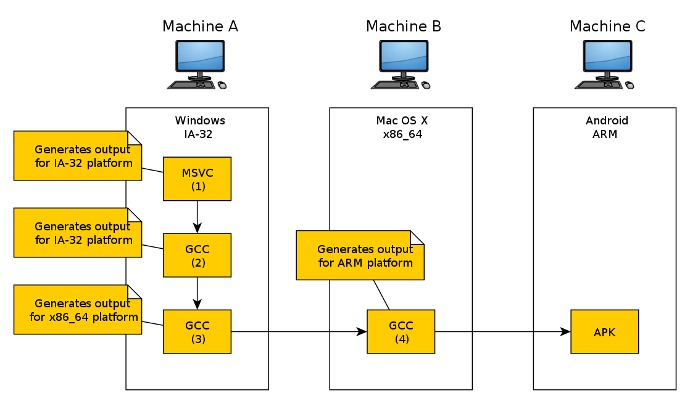

# Кросс-компилятор

Кросс-компилятор — такой компилятор, который генерирует двоичные файлы для платформы, отличной от той, на которой этот компилятор запускается. Он может быть полезен, например, когда нужно скомпилировать программу для той платформы, экземпляров которой в данный момент в наличии нет, либо когда сборка непосредственно на этой (целевой) платформе невозможна или нецелесообразна, например, когда нужно собрать программу для маломощного встраиваемого ARM-компьютера, сборка программы непосредственно на котором будет происходить либо очень долго, либо не происходить вообще ввиду ограниченной производительности такого компьютера.

- **Хост** (host) — компьютер, **на** котором производится сборка;
- **Цель** (target) — компьютер, **для** которого производится сборка.

## Строение кросс-компилятора

Помимо самог*о* кросс-компилятора требуются скомпилированные для целевой платформы пакет `binutils` (особенно важно наличие GNU Assembler), содержащий программы для работы с объектными файлами, стандартная библиотека языка С (в LFA используется библиотека Musl) и заголовки ядра Linux.

## Канадский крест

Канадский крест — это метод сборки кросс-компилятора для целевых архитектур. Например:

- Фирменный родной компилятор для компьютера (№1) используется для сборки «родного» компилятора для компьютера (№2).
- Родной компилятор для компьютера (№2) используется для сборки кросс-компилятора с компьютера A на компьютер B (№3).
- Кросс-компилятор с компьютера A для компьютера B используется для сборки кросс-компилятора для компьютера C (№4).

---

> **Смотрите также:**
>
> - [**Cross compiler**](https://en.wikipedia.org/wiki/Cross_compiler) (<https://en.wikipedia.org/>).
