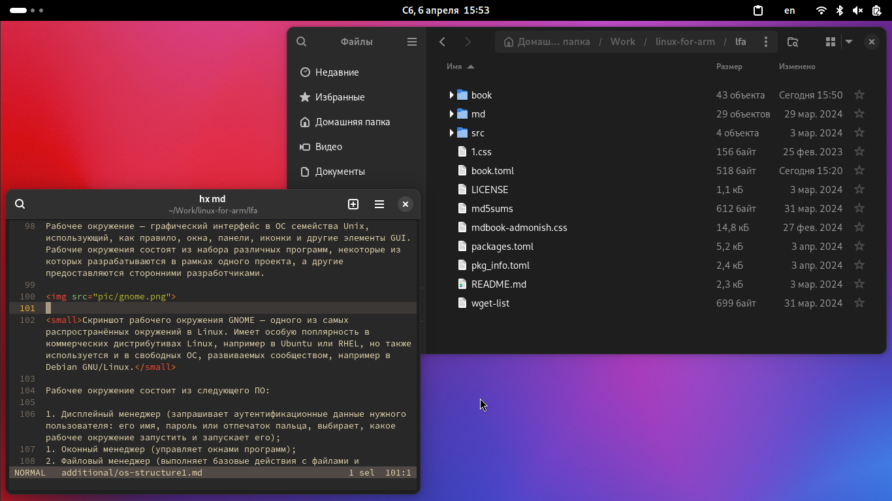

# Заметки об ОС Linux. Часть 1. Обзор

## Операционные системы

Определение, что же такое ОС, весьма объёмно и всеобъемлюще. Но вкратце можно сказать о том, что операционная система — это программное обеспечение, управляющее аппаратным обеспечением компьютера и предоставляющее какие-либо абстракции для остального прикладного ПО, которое запускается на компьютере. Примером таких абстракций можно назвать файл на жёстком диске: компьютер сам по себе не знает, что такое файл, ровно как и на жёстком диске или ином носителе информации у нас содержится последовательность данных, которую мы не можем назвать «файлом» в привычном для нас смысле этого слова. Уже операционная система предоставляет пользователю (и программисту, и программам, запускающимся на этой ОС) такую абстракцию, которая «преобразует» эти данные на жёстком диске в привычные нам файлы и папки.

В широком смысле под операционной системой подразумевается совокупность ядра и работающих поверх него программ и утилит.

### Встраиваемые (embedded) системы

LFA основана на руководстве CLFS Embedded, в котором приведены сведения по сборке встраиваемой системы для архитектуры ARM. Поэтому неудивительно, что прямо сейчас описываются именно встраиваемые операционные системы. Встраиваемая ОС (Embedded OS) — такая ОС, которая работает, будучи встроенной непосредственно в девайс, которым она управляет. Т.е. это часть специализированного устройства или платформы, такой как, например устройство бытовой электроники или часть из системы умного дома.

Встроенный компьютер отличается от персонального тем, что встроенная система как правило спроектирована для одной или нескольких конкретных целей, в то время как ПК предназначены для выполнения широкого круга задач. Встроенный компьютер может иметь минимально возможную для выполнения конкретной задачи производительностью, что обеспечивает лёгкую и эффективную компьютерную платформу.

### Семейство Unix

Среди современных операционных систем наиболее распространены два семейства: семейство операционных систем Windows и семейство операционных систем Unix. ОС семейства UNIX нашли применение на суперкомпьютерах, серверах, встраиваемых системах, мобильных устройствах, а с недавнего времени проникают и в сегмент компьютеров для обычных пользователей или офисного плангтона.

Unix — это семейство переносимых, многозадачных и многопользовательских систем. Главная особенность таких систем заключается в том, что это *изначально* многопользовательские и многозадачные ОС, а также такие ОС созданы таким образом, чтобы их было легко переносить с одной процессорной архитектуры на другую. Модульная структура ОС этого семейства наряду с поддержкой широкого спектра микропроцессоров и других типов оборудования сделала такие ОС достаточно популярными и во встраиваемых решениях.

К семейству Unix относятся многие ОС, например FreeBSD, OpenBSD, NetBSD, macOS X (версии 10.+), minix и другие. Кроме того, к этому семейству, пусть и косвенно (поскольку они не основаны на исходном коде оригинальной UNIX или какого-то из её ответвлений), относятся и ОС, использующие ядро Linux.

## ОС, использующие ядро Linux

Linux — это монолитное ядро операционной системы, распространяемое как свободное ПО на условиях лицензии GNU GPL (кроме несвободных компонентов, включая драйверы, использующие прошивки, распространяемые под другими лицензиями). Linux можно назвать «сердцем» любой ОС, описываемой в данном руководстве, в том числе это «сердце» и собранного по этому руководству дистрибутива LFA.

Полноценная ОС не может существовать только из одного ядра, тк ей нужны программы, предназначенные для обеспечения работы и взаимодействия с этой ОС: стандартная библиотека языка С (glibc, musl, bionic, etc.), [загрузчик ОС](os-structure2.md) (GRUB, systemd-boot, syslinux, U-Boot), [система инициализации](os-structure3.md) (SysVInit, OpenRC, Runit, upstart, systemd) и набор [стандартных утилит](os-structure4.md) для работы с компонентами этой ОС (работа с файлами, правами доступа, процессами, пользователями, группами пользователей и т.п., обычно такие утилиты называются «coreutils»: GNU coreutils, uutils coreutils, etc.).

### Свободное ПО

Операционная система, использующая ядро Linux, а также все её системные компоненты и большинство её пользовательских приложений — свободные программы. Свободное ПО отличается от несвободного тем, что его можно:

- запускать на любом количестве компьютеров без всевозможных лицензионных ограничений;
- распространять бесплатно или за деньги без каких-либо ограничений;

Кроме того, пользователи могут получать исходный код свободного ПО, изучать и модифицировать его, а также распространять модифицированные копии такого ПО.

### Разработка ОС с ядром Linux

В отличие от распространённых несвободных ОС вроде Windows или macOS, Linux не имеет географического центра разработки, ровно как нет конкретной фирмы или компании, владеющей Linux, нет и единого координационного центра разработки. Эта ОС — результат работы тысячи программистов по всему миру[^1].

## Компоненты ОС с ядром Linux

### Ядро Linux

Как упоминалось ранее, ядро Linux — это «сердце» операционной системы, которое, к тому же, соответствует стандарту POSIX и распространяется под лицензией GNU GPLv2. Несмотря на *свободную* лицензию, в составе ядра есть и несвободные компоненты: как правило, это драйверы, использующие несвободные прошивки и иные составляющие.

Linux поддерживает многозадачность, виртуальную память, динамические библиотеки и прочее, что свойственно современным операционным системам. Это монолитное ядро с поддержкой динамически загружаемых модулей. В монолитных ядрах все их компоненты (например, драйверы) как бы встроены в одно большое ядро. Это является противоположностью, например, микроядрам, где очень многие компоненты являются отдельными частями, которые не входят непосредственно в состав ядра (например, это справедливо по отношению к ядру операционной системы Minix).

Из плюсов монолитных ядер можно отметить более прямой доступ к аппаратным средствам, а из минусов: б*о*льший размер ядра и б*о*льшее потребление оперативной памяти. Другой минус заключается в том, что когда мы подключаем к компьютеру какое-то новое устройство, драйвер которого существует для монолитного ядра, но в данный момент он не «встроен» в это ядро (т.е. ядро не было скомпилировано с поддержкой этого драйвера), то нам придётся пересобирать ядро, включив там поддержку этого драйвера, что иногда бывает не очень удобным вариантом.

В итоге ядро Linux обзавелось механизмом *модулей*, которые устанавливаются в отдельный каталог (например, в `/lib/modules`). Модули мы можем подключать, когда они нам нужны, а когда необходимость их использования сойдёт на нет, их можно выгрузить.

### Загрузчик

Задача загрузчика — инициализировать и запустить ядро. На компьютерах с архитектурой ARM он может выполнять несколько больше [функций](os-structure2.md), но в основном всё сводится именно к инициализации и запуску ядра ОС.

### Система инициализации

Ядро запускает систему инициализации (`init`). В задачи `init` входит подготовка ОС к дальнейшей работе: инициализация консолей, монтирование виртуальных файловых систем и запуск компонентов системы. Процесс `/sbin/init` работает как демон и имеет `PID`=`1`.

Из основных реализаций системы инициализации в Linux можно отметить systemd, SysVInit, runit и OpenRC. В проекте LFA используется система инициализации из состава BusyBox.

`init` загружается первым процессом (пользовательского режима) после инициализации ядра и отвечает за дальнейшую загрузку системы. Для этого он может либо запускать загрузочные скрипты (написанные, как правило, на BASH или каком-то другом скриптовом языке), либо читает специальные конфигурационные файлы с параметрами загрузки (такое поведение есть, например, у systemd).

Во многих системах Linux (особенно коммерческих) получил наибольшее распространение systemd. Это довольно удобная и функциональная система инициализации, однако некоторые пользователи критикуют её за раздутость, наличие многих ненужных пользователям функций (некоторые компоненты из systemd заменяют `chroot`, `cron` и средства для ведения логов системы), а также несколько более высокое потребление ресурсов компьютера по сравнению с другими системами инициализации. Лично для меня существенным недостатком [скорее не самог*о* systemd, а ряда программ, «прибитых» к нему] является то, что ряд ПО «прибит» к нему и работа такого ПО на системах с другими инитами может быть несколько затруднительной. Примерами такого ПО можно привести рабочие окружения GNOME и KDE. Тем не менее, systemd — довольно продвинутая система инициализации, которая не даром набрала популярность во многих дистрибутивах Linux.

### Стандартная библиотека языка С

Поскольку системные компоненты ОС Linux написаны преимущественно на языке программирования С, в системе присутствует стандартная библиотека этого языка, с которой динамически линкуются программы системы. Эта стандартная библиотека (`libc`) содержит системные вызовы и основные функции, которые используются в программе, например функции для работы с файлами, выделения памяти, форматирования вывода в консоль и т.д.

Существует множество различных стандартных библиотек С, самая распространённая из которых — GNU C Library (`glibc`). Она используется почти во всех известных дистрибутивах GNU/Linux. Однако её часто критикуют за «раздутость» и низкую скорость работы по сравнению с другими библиотеками.

В LFA используется стандартная библиотека С `musl`. Она была написана с нуля, без переиспользования существующего кода. При её написании уделялось внимание эффективной статической линковке программ. Эта стандартная библиотека получила распространение в минималистичных дистрибутивах Linux, например в Alpine Linux, OpenWRT и других. Применение `musl` может быть оправдано в минималистичных и встраиваемых системах, поэтому использование её в LFA в целом является хорошей идеей.

### Стандартные утилиты UNIX (coreutils)

coreutils — это набор базовых утилит операционной системы, которые включают в себя программы для управления файлами (создание, удаление, копирование и перемещение файлов и каталогов, создание ссылок и блочных файлов), правами доступа к файлам (изменение прав доступа к файлу и каталогу, смена владельца и группы файла, etc.), проверки контрольных сумм файлов, работы с текстовой информацией и т.д.

Во многих дистрибутивах Linux в качестве реализации стандартных утилит выступает пакет GNU Coreutils, однако кроме него есть и другие. Например, существует реализация coreutils на языке программирования Rust ([uutils coreutils](https://uutils.github.io/coreutils/)). Во встраиваемых системах применяются более простые (а значит и более минималистичные и нетребовательные к ресурсам ПК) реализации, такие как BusyBox и ToyBox, которые объединяют все вышеописанные утилиты в один бинарный файл, имеющий размер от нескольких сотен Кбайт до 2-3 МБайт.

### Командная оболочка (shell)

Для того, чтобы пользователь мог взаимодействовать с операционной системой и программами, которые в неё установлены, требуется какая-либо оболочка. Это может быть либо командный интерпретатор типа `sh`, `ash`, `zsh`, `csh` или `bash`, либо графическое пользовательское окружение типа GNOME или KDE.

В командной оболочке пользователь может либо давать команды ОС, либо запускать файлы, в которых содержатся списки этих команд (такие файлы называются скриптами).

Командные оболочки позволяют не только запускать какие-либо программы и передавать этим программам нужные аргументы и значения, но также объявлять свои переменные, в которых будут содержаться определённые значения, использовать циклы, конструкции ветвления, а также использовать другие возможности, которые обычно присущи языкам программирования.

В операционных системах семейства Unix пользователь может использовать ветвления, циклы, функции, переменные, работать с арифметическими выражениями, сравнивать числа и строки, а также работать с текстовой информацией.

Эти возможности командных оболочек повсеместно используются во всех системах Unix, в том числе и дистрибутивах Linux. Начиная с процесса загрузки ОС, заканчивая какими-либо пользовательскими задачами. Преимущества Unix-оболочек используются и в этом руководстве при сборке системы.

Во многих дистрибутивах Linux в качестве командной оболочки используется BASH, однако во всяких минималистичных и/или встраиваемых системах можно встретить что-то вроде `ash` из состава BusyBox — микроверсию оболочки `sh`, обеспечивающую базовую функциональность shell'а. В других ОС семейства Unix можно встретить `csh` или `tcsh` (например, во FreeBSD), либо `zsh` (в macOS).

### Рабочее окружение (Desktop Environment)

Рабочее окружение — графический интерфейс в ОС семейства Unix, использующий, как правило, окна, панели, иконки и другие элементы GUI. Рабочие окружения состоят из набора различных программ, некоторые из которых разрабатываются в рамках одного проекта, а другие предоставляются сторонними разработчиками.

<small>Скриншот рабочего окружения GNOME — одного из самых распространённых окружений в Linux. Имеет особую поплярность в коммерческих дистрибутивах Linux, например в Ubuntu или RHEL, но также используется и в свободных ОС, развиваемых сообществом, например в Debian GNU/Linux.</small>

Рабочее окружение состоит из следующего ПО:

1. Дисплейный менеджер (запрашивает аутентификационные данные нужного пользователя: его имя, пароль или отпечаток пальца, выбирает, какое рабочее окружение запустить и запускает его);
1. Оконный менеджер (управляет окнами программ);
2. Файловый менеджер (выполняет базовые действия с файлами и каталогами: просмотр содержимого директорий, переименование, перемещение, копирование, удаление файлов и директорий, создание ссылок и т.д.);
3. Панель, на которой расположены апплеты для взаимодействия с окружением (главное меню со списком приложений, часы, область уведомлений, панель управления, на которой можно изменять т.н. «быстрые параметры»: включение/выключение Wi-Fi, Bluetooth, регулировка звука и яркости экрана, кнопки для выключения/перезагрузки компьютера или выхода из текущей сессии пользователя, etc.);

В Unix традиционно за обеспечение работы графических пользовательских окружений отвечает X Window System. Это сервер, обеспечивающий базовые функции графической среды: отрисовку и работу окон (их перемещение на экране, изменение размера, etc.), взаимодействие с устройствами ввода (мышь и клавиатура) и т.д. За всё остальное отвечают, как правило, оконные менеджеры, работающие поверх X и определяющие интерфейс и взаимодействие с пользователем.

Оконные менеджеры могут использоваться как в составе рабочего окружения, так и отдельно от него.

В последнее время наблюдается тенденция на отказ от X Window System в пользу протокола Wayland. Он обладает некоторыми достоинствами по сравнению с X.org (по крайней мере это не монолитный и запутанный монстр типа X.org, в котором давным-давно не разбираются даже разработчики, а вполне себе элегантная и простая вещь, вести разработку которой в разы легче и куда проще добавлять новые функции). Кроме того, Wayland не имеет присущих X недостатков и уязвимостей.

Вместо оконных менеджеров для Wayland применяются композитные менеджеры. Среди таких композитных менеджеров для Wayland можно отметить:

1. Weston — эталонная реализация композитного менеджера Wayland;
2. Sway — аналог тайлинговых оконных менеджеров типа i3-wm для Wayland;
3. Mutter — из состава рабочего окружения GNOME;
4. KWin — из состава рабочего окружения KDE;

Рассмотрим строение рабочего окружения на примере GNOME Shell:

1. Дисплейный менеджер GDM;
2. Оконный/композитный менеджер Mutter;
3. Файловый менеджер Nautilus;
4. Оболочка GNOME Shell (включает в себя верхнюю панель с переключателем рабочих столов, часы и панель уведомлений, панель быстрых настроек, главное меню, dock со списком запущенных и закреплённых приложений, ряд диалогов и т.д.);

Все компоненты рабочих окружений, как правило, тесно интегрированы друг с другом и составляют целую «экосистему» связанного друг с другом ПО.

Во встраиваемых системах как правило нет графического пользовательского окружения, поскольку такие окружения достаточно тяжёлые для слабого встраиваемого оборудования.

[^1]: ровно поэтому нет и не может быть никаких «отечественных дистрибутивов Linux» или уж того хуже «отечественных операционных систем» (100% которых — просто дистрибутивы Linux, не более). Вклад российских разработчиков в развитие Linux ровно такой же, как и вклад любого другого разработчика из любого другого государства. Поэтому некорректно называть какой-то дистрибутив российским, французским, китайским и т.д.
