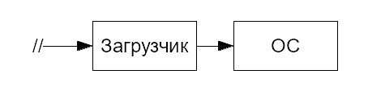
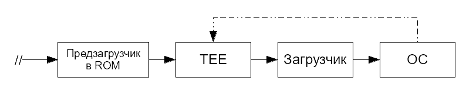

# Заметки об ОС Linux. Часть 2. Процесс загрузки

> Б*о*льшая часть сведений здесь взята из статьи [Загрузка ОС на ARM](https://habr.com/ru/companies/aladdinrd/articles/338806/) на Хабре.

```admonish warning title="Внимание"
Здесь будут даны сведения о загрузке Linux на ARM. Особенности загрузки других ОС затронуты не будут, поскольку это не тема данного руководства.
```

## Загрузчик ОС

Загрузчик обеспечивает запуск ОС и ряд сервисных функций, например проверку целостности образа ОС перед запуском, обновление ПО, самотестирование и т.д. Очень часто в качестве загрузчика можно встретить U-Boot или иные решения с открытым исходным кодом. Для x86_64 «собратьев» обычно применяются GRUB и systemd-boot.

Таким образом, если очень сильно упростить, то процесс загрузки ОС выглядит следующим образом:



Здесь знаком `//` отмечен момент подачи питания или сброса процессора. Такой простой способ запуска был у некоторых процессоров ARMv7. В более новых версиях процессоров процесс куда сложнее, чем на приведённой схеме.

Схема «Загрузчик» -> «ОС» очень удобна из практических соображений, ведь загрузчик берёт на себя всю низкоуровневую работу:

- Инициализирует память перед запуском ОС и загружает ядро ОС в память
- Инициализирует часть периферии
- Иногда реализует хранение двух образов ОС: текущего и резервного или образа для восстановления

Например, для запуска Linux на ARM загрузчик должен инициализировать память, хотя бы один терминал, загрузить образ ядра и [Devicetree](dtb.md) в память и передать управление ядру. Всё это описано в [**документации**](https://www.kernel.org/doc/Documentation/arm/Booting) Linux. Код инициализации ядра Linux не будет делать сам то, что должен делать загрузчик.

Рассмотрим работу загрузчика на примере U-Boot:

1. После включения или сброса процессор загружает образ U-Boot в ОЗУ и передаёт управление на первую команду этого образа.
2. U-Boot инициализирует DDRAM.
3. U-Boot инициализирует драйверы загрузочного носителя (ЗН), например eMMC, NAND Flash и т.д.
4. U-Boot читает с ЗН область переменных конфигураций. В конфигурации задан скрипт загрузки, который U-Boot далее исполняет.
5. U-Boot выводит предложение прервать процесс загрузки и сконфигурировать устройство. Если за 2-3 секунды пользователь этого не сделает, запустится загрузочный скрипт.
6. Иногда скрипт начинается с поиска подходящего образа ОС для загрузки на всех доступных носителях. В других случаях ЗН задаётся в скрипте жёстко.
7. Скрипт загружает с ЗН в DDRAM образ ядра (`zImage`) и файл Devicetree с параметрами ядра.
8. Дополнительно скрипт может загрузить в память образ `initrd`.
9. `zImage` состоит из распаковщика и сжатого образа ядра. Распаковщик развёртывает ядро в памяти.
10. Начинается загрузка ОС.

## Предзагрузчик

Однко в реальности почти никогда не бывает, чтобы команды загрузчика выполнялись первыми после включения или сброса процессора, тем более на современных ARM-процессорах.

Любое ядро ARM-процессора при сбросе начинает исполнение с адреса 0, где записан вектор `reset`. Старые процессоры буквально начинали загружаться с внешней памяти, отображённой по нулевому адресу, и тогда первая команда процессора была первой командой загрузчика. Однако для такой загрузки подходит только параллельная NOR Flash или ROM. Эти типы памяти работают очень просто: при подаче адреса они выдают данные. Характерный пример параллельной NOR Flash — микросхема BIOS в x86/x86_64 компьютерах.

В современных системах используются другие виды памяти, потому что они дешевле, а их объём больше. Это, например, NAND, eMMC, SPI/QSPI Flash. Эти типы памяти уже не работают по типу «подал адрес — читаешь данные», а значит, что для прямого исполнения команд из них не подходят. Даже для простого чтения нужно написать специальный драйвер, поэтому мы имеем проблему «курицы и яйца»: драйвер нужно откуда-то заранее загрузить.

По этой причине в современные ARM-процессоры интегрировано ПЗУ с предзагрузчиком. ПЗУ отображено в процессоре на адрес 0, и именно с этого адреса начинается исполнение команд процессором.

Задачи предзагрузчика:

1. Определение конфигурации подключенных устройств;
2. Определение загрузочного носителя (ЗН);
3. Инициализация устройств и ЗН;
4. Чтение загрузчика с ЗН;
5. Передача управления загрузчику.

Конфигурация предзагрузчика обычно устанавливается одним из двух способов:

- Схемотехнически — подключением определённых выводов процессора к земле или шине питания;
- Записывается в однократно программируемую память процессора на этапе производства.

В целом почти всегда есть возможность задать единственный вариант загрузки или основной и несколько альтернативных.

Подобный предзагрузчик устанавливается как в процессорах типа Cortex-A, так и в микроконтроллерах, даже таких маленьких, как Cortex-M0. Вместе с предзагрузчиком процедура запуска ОС выглядит так:


Код предзагрузчика пишется производителем конкретного SoC, а не компанией ARM, является частью SoC как продукта компании-производителя и защищён авторским правом.

Использования предзагрузчика в большинстве сценариев избежать нельзя.

```admonish note title="Спойлер" collapsible=true
У ARMv8-A есть специальная микропрограмма под названием ARM Trusted Firmware (TF-A). Это системное ПО, отвечающее, например, за управление питанием (PSCI). Этот код можно считать, в какой-то степени, BIOS для ARMv8. У более ранних процессоров (например, ARMv7) такого ПО нет.
```

## TrustZone

В процессоры ARM Cortex-A и Cortex-R встраивается технология [**TrustZone**](https://www.arm.com/products/security-on-arm/trustzone). Эта технология позволяет на аппаратном уровне выделить два режима исполнения: Secure (Безопасный) и Non-Secure (Гостевой).

Эти процессоры в основном нацелены на рынок смартфонов и планшетных ПК, где TrustZone используется для создания в режиме Secure доверенной «песочницы» для исполнения кода, связанного с криптографией, DRM, хранением пользовательских данных.

В режиме Secure при этом запускается специальная ОС, называемая в общем случае TEE (Trusted Execution Environment, Доверенная Среда Исполнения), а «нормальная» ОС, такая как Linux, iOS и т.д., запускается в режиме Non-Secure. При этом права доступа к некоторым устройствам ограничены для «нормальной» ОС, поэтому её ещё называют *гостевой ОС*.

Из-за наложенных ограничений гостевая ОС вынуждена время от времени вызывать функции TEE для исполнения некоторых операций. TEE продолжает существовать параллельно с гостевой ОС, и гостевая ОС не может с этим ничего поделать.

Например, гостевая ОС использует функции TEE для:

- Включения и выключения ядер процессора (в ARMv8-A это происходит через PSCI — часть TF-A);
- Хранения ключей, банковских карт и т.п.
- Хранения ключей полнодискового шифрования;
- Операций с криптографией;
- Отображения DRM-контента.

Процесс загрузки ОС на ARM (Cortex-A) примерно выглядит так:



На схеме пунктиром обозначен путь обращения из ядра ОС в TEE.
